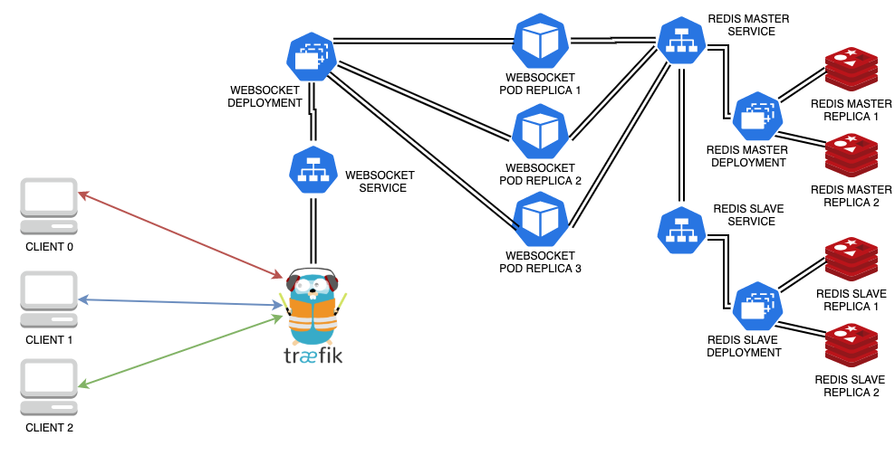

# Scaling Websockets in the Cloud (Part 2). Introducing Traefik: the all-in-one dynamic and flexible solution for Docker Stacks and Kubernetes clusters

## Recap

In [Part 1](BLOG.md) we journeyed from a simple websocket application to a quite advanced Kubernetes configuration.
The final architecture looks like the following diagram.

|  |
| :--: |

You may remember that one of the key points in the whole multi-server pattern was leveraging an element which acts as `Reverse Proxy`.
In the case of Docker configuration we defined a service in *docker-compose*, whereas in Kubernetes it was easier to employ a simple Service Resource, in that case exposed as a `NodePort`.

It would be nice to have a solution that is suitable for both cases maybe reusing some configurations.
Morover Kubernetes may require even more attention since resources can be rescheduled quite often, so the configuration should be flexible enough to keep up with this dynamic pattern.

## Traefik: one answer addressing many issues

> `Traefik` is an open-source *Edge Router* that makes publishing your services a fun and easy experience. It receives requests on behalf of your system and finds out which components are responsible for handling them.

Traefik has a multipurpose structure so that it can be employed as a standalone service but, thanks to the concepts of `Providers`, it works smoothly in a fully `Docker` environment or as a `Kubernetes` resource, likely with many others third party.

|  |
| :--: |

The above image explain tha basic blocks of `Traefik`:

* Entrypoints (network points of access to the infrastructure)
* Routers (forwarders of requests to the corresponding service)
* Middlewares (chainable modifiers of requests before they are forwarded or responses before they are forwarded back to requestors)
* Services (abstract representation of the service the will effectively handle all request)
* Providers (orchestrators, container engines, cloud providers, or key-value stores whose APIs Traefik is able to query to find relevant information about routing)

>`Tip`: take a moment to understand basic concepts and different kind and blocks of configuration in `Traefik`, you will become immediately friends. Otherwise it may happen that it gives you hard time. That's part of the game, deal with it at the end you will cope and win together.

Traefik is now at version 2.2. and it comes *batteries included*! Indeed *out-of-the-box* you can leverage its `Dashboard` that provides usage statistics but above all a visual overview of the setup configured.

|  |
| :--: |

This is particularly useful when you'll need to troubleshoot your configuration as you may visually find which component is not correctly working or whether a dynamic configuration is not actively recognizing the expected element.

### Configuring Traefik

Traefik can have either a `static` or a `dynamic` configuration. Most of the option blocks in the static configuration are available seamlessly in the dynamic one.

In a static configuration the Traefik elements are defined at startup and they are not expect to change over time.
The confguration can be defined either as:

* Traefik CLI parameters (referred as `CLI` in doc)
* Environment variables
* Text File (either in `yaml` or `toml` format)

What is more interesting is `dynamic` configuration. This can change and is seamlessly hot-reloaded, without any request interruption or connection loss. Depending on the provider Traefik will listen to any change and adapt to any change in configuration.

Static and dynamic configuration can be mixed and work together without any problem. It is quite common to launch Traefik CLI with some options and then allow dynamic parts to complete the configuration. Indeed  you will usuall declare the provider (e.g. Kubernetes, Docker, File) in Traefik CLI and then leave all the rest of configuration as dynamic one using different patterns, according to any specific provider:

* `Labels` for Docker provider
* `CRD` or `Ingress` for Kubernetes provider
* `TOML` or `YAML` format for plain File provider

Going back to what explained at the beginning, this philosopy is particularly useful:

* it adapts to a K8S cluster where resources can be quickly scheduled or terminated.
* it is reusable and adaptable, since the same configuration elements (entrypoints,routers,middlewares) either if we are working in Docker or in Kubernates.

>`Tip`: Traefik has a vast and deep documentation. Many examples are included, most of the time they are referred with multiple providers variant. Sometimes only `File Provider` fashion. Since you will likely employ another provider, don't be scared, the transition is simple enough.

### TLS & HTTPS

One of the key feature of Traefik is its ability to natively handle HTTPS traffic and TLS connections. Traefik is able to handle very easily HTTP to HTTPS redirection and TLS certificates support. The latter include a very powerful management of certificates through [Let's Encrypt (ACME)](https://docs.traefik.io/https/acme/) which is able to challenge to generate and renew ACME certificates by itself.

This part is out of the scope of this post but it is a fundamental feature when you will deploy Traefik in produciton.

## Traefik in Docker

Traefik can be defined as a single service in compose file.

Interested services will be dynamically configured and reachable using the concept of [Docker Labels](https://docs.docker.com/compose/compose-file/#labels). This list of labels will contain all the definitions allowing Traefik to discover the interested service.

>`Tip`: If any sort of troubleshooting is needed enable access logging and debug level detail by adding theese options to Traefik CLI service:

```yaml
  - "--accesslog"
  - "--log.level=DEBUG"
```

### Docker Stack in action

The new stack will swap HAProxy service (or any other Reverse Proxy) with a Trefik container, whose CLI will declare any static configuration .

```yaml
traefik-reverse-proxy:
  image: traefik:v2.2
  command:
    - "--api.insecure=true"
    - "--accesslog"
  ports:
    - "80:80"
    # The Web UI (enabled by --api.insecure=true)
    - "8080:8080"
  volumes:
    # allow Traefik to listen to the Docker events
    - /var/run/docker.sock:/var/run/docker.sock
```

As you see the key part is mapping Docker daemon into Traefik, hence it will be able to listen to any configuration change in the stack

All the necessary configuration parts will be dynamic and left to the `Docker Provider`. It will placed in the websocket appication service as `label` items of service configuration:

```yaml
socket-server:
  image: sw360cab/wsk-base:0.1.1
  restart: always
  deploy:
    mode: replicated
    replicas: 2
  environment:
    - "REDIS_HOST=redis"
  labels:
    - "traefik.http.routers.socket-router.rule=PathPrefix(`/wsk`)"
    - "traefik.http.services.service01.loadbalancer.server.port=5000"
    - "traefik.http.services.service01.loadbalancer.sticky.cookie=true"
    - "traefik.http.services.service01.loadbalancer.sticky.cookie.name=io"
    - "traefik.http.services.service01.loadbalancer.sticky.cookie.httponly=true"
    - "traefik.http.services.service01.loadbalancer.sticky.cookie.secure=true"
    - "traefik.http.services.service01.loadbalancer.sticky.cookie.samesite=io"
    - "traefik.http.middlewares.socket-replaceprefix.replacepath.path=/"
    - "traefik.http.routers.socket-router.middlewares=socket-replaceprefix@docker"
```

>Note: in this configuration I added another step of complexity. We expect the websocket application to be exposed at the `/wsk` path instead of root path. This will allow us to see `middlewares` of Traefik in action

These *labels* define:

* a router and its rules, which handles the requests to the `PathPrefix` "/wsk"
* a service, which references the port exposed by websocket application service (*5000*), and addresses the issue of achieving `sticky` sessions
* a middleware, which will translate all the requests received at the `/wsk` path, into what the websocket service is expecting: `/`.

In this line:

```yaml
- "traefik.http.routers.socket-router.middlewares=socket-replaceprefix@docker"
```

The middleware defined is dynamically associated with the router by a list of formatted strings of type `<middleware_name>@<provider_name>.

>`Note`: the names of router (`socket-router`), service (`service01`) and middleware (`socket-replaceprefix`) do not follow any convention and are absolutely up to you.

At this point you just need to lauch the stack again, with:

```bash
docker stack deploy --compose-file stack/docker-compose.yml wsk
```

Then check out the Traefik Dashboard exposed by default at <http://localhost:8080> and if no error are show get your websocket client ready to connect. Don't forget to tune its configuration, now to reach the websocket service it will contact directly Traefik, which in turn is now exposing the service at path `/wsk`.

```Javascript
const io = require('socket.io-client');
const client = io('http://localhost:80', {
  path: '/wsk'
  transports: ['websocket']
});
```

And the magic should happen! The communication among clients and websocket services keep on working smootly!

## Traefik in Kubernetes

Dynamic configuration of Traefik in Kubernetes may act as an `Ingress` resource: an entrypoint to a specific service, that can be bound to a domain name and port. In version 2.2 Traefik improved its terminology, hence the state of the art is actually defining an `Ingress Route` through a Kubernetes `CRD` (Custom Resource Definition).

Here is the new architecture introducing `Traefik` as first point of access:

|  |
| :--: |

In this environment Traefik require the definition of the following resources:

* CRD
* RBAC (Role-Based Access Control) defining these items:
  * ServiceAccount
  * ClusterRole (with access to specific api groups in K8S)
  * ClusterRoleBinding (binding the previous two items)
* Deployment (Traefik Pod definition)

```Yaml
serviceAccountName: traefik-ingress-controller
containers:
  - name: traefik
    image: traefik:v2.2
    args:
      - --api.insecure
      - --accesslog
      - --entrypoints.web.address=:80
      - --entrypoints.websecure.address=:443
      - --providers.kubernetescr
```

* Service (exposing the entrypoint and the Dashboard to the external world)
* the `IngressRoute`. The core of our configuration, specifing the router rules, the service to be bound, the entrypoint of reference and eventually extra-rules of middlewares.

```yaml
kind: IngressRoute
apiVersion: traefik.containo.us/v1alpha1
metadata:
  name: simpleingressroute
  namespace: default
spec:
  entryPoints:
    - web
  routes:
  - match: PathPrefix(`/`)
    kind: Rule
    services:
    - name: wsk-svc
      port: 3000
```

The provious configuration define an IngressRoute related to the entrypoint `web` (which wa defined above in Traefik deplooyment), and a rule the match everything having that `PathPrefix` to a specific Kubernetes service resource.

>`Tip`: whether your service will have access from a predifined domain name, the router *match* rules will be something like:

```yaml
- match: Host(`your.example.com`) && PathPrefix(`/`)
```

### Replacing NodePort and run

In the first Kubernetes configuration we used to expose the websocket service as `NodePort`. With Traefik we can skip this as it will be in charge of properly exposing the service outisde the cluster by its `IngressRoute` custom resource.

So after defining Traefik resources configuration parts. The `NodePort` part should be removed from websocket service resource. It won't need to be exposed in any way, it will look like that:

```yaml
apiVersion: v1
kind: Service
metadata:
  name: wsk-svc
spec:
  selector:
    app: wsk-base
  ports:
    - protocol: TCP
      port: 3000
      targetPort: 5000
```

Now we are ready to lauch K8s new resources. First off all let's define the new CRD, then launch Traefik resource and finally redeploy websocket service (supposing it has been already scheduled)

```bash
# Launch Traefik CRD
kubectl create -f k8s/traefik/crd.yaml
# Lauch Traefik RBAC,deployment/service,ingressRoute
kubectl create -f k8s/traefik/rbac.yaml,k8s/traefik/traefik.yaml,k8s/traefik/ingress.yaml
# Reschedule websocket Service
kubectl apply -f k8s/wsk/wsk-service.yaml
```

### A Traefik Middleware

`Middlewares`  are a key concept in Traefik as they add very powerful manipulation possibilities to incoming requests
There is a long [list](https://docs.traefik.io/middlewares/overview/) of natively available ones in the official doc.

As for the Docker configuration also for Kubernetes we may expose our weboscket service at path `/wsk`. Respect to the previus configuration, this change requires only a slight change by:

1. introducing a `StripPrefix` Middleware resource (using another Traeefik CRD).
2. adding the previous middleware reference to the list of middlewares in the Router within the IngressRoute configuration.

The final result is the following:

```yaml
kind: Middleware
apiVersion: traefik.containo.us/v1alpha1
metadata:
  name: socket-replaceprefix
spec:
  replacePath:
    path: /
---
kind: IngressRoute
apiVersion: traefik.containo.us/v1alpha1
metadata:
  name: simpleingressroute
  namespace: default
spec:
  entryPoints:
    - web
  routes:
  - match: PathPrefix(`/wsk`)
    kind: Rule
    services:
    - name: wsk-svc
      port: 3000
    middlewares:
    - name: socket-replaceprefix
```

As you may notice the previous steps are the same required while we performed this change in Docker configuration above.

## Path Prefix Gotchas

`Socket.io` by default will expose the default websocket endpoint adding a `/socket.io` suffix at the end. This is quite strange when you start reaching your websocket in a complex environment.

The solution is fixing the path of the websocket in the application.

```Javascript
const socketServer = require('http').createServer();
const io = require('socket.io')(socketServer, {
  path: '/'
})
```

## Conclusion

In this part we introduced `Traefik` which is an impressive tool. It is powerful and straightforward to configure.
However you know that `from great power comes great responsability`, so my suggestion is to:

* understand Traeik basic concepts
* have clear in mind what is the final result you expect

Otherwise you will end up trying again and again to adjust your configuration, which will keep not working (that comes from a true story...mine).

If you have clear where you want to go Traefik will be a good friend. As you may have noticed it solved both the use cases in Docker and Kubernetes in one-shot. Amazing!

## References

* [sw360cab/websockets-scaling: A tutorial to scale Websockets both via Docker Swarm and Kubernetes](https://github.com/sw360cab/websockets-scaling)
* [Concepts - Traefik](https://docs.traefik.io/getting-started/concepts/ "Concepts - Traefik")
* [Docker - Traefik](https://docs.traefik.io/providers/docker/ "Docker - Traefik")
* [Docker - Traefik](https://docs.traefik.io/routing/providers/docker/ "Docker - Traefik")
* [Docker - Traefik](https://docs.traefik.io/reference/dynamic-configuration/docker/ "Docker - Traefik")
* [Kubernetes IngressRoute - Traefik](https://docs.traefik.io/routing/providers/kubernetes-crd/ "Kubernetes IngressRoute - Traefik")
* [Middlewares - Traefik](https://docs.traefik.io/middlewares/overview/ "Middlewares - Traefik")
