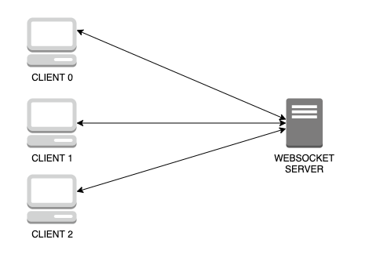
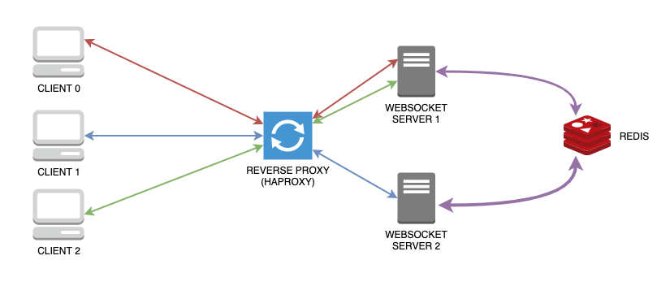
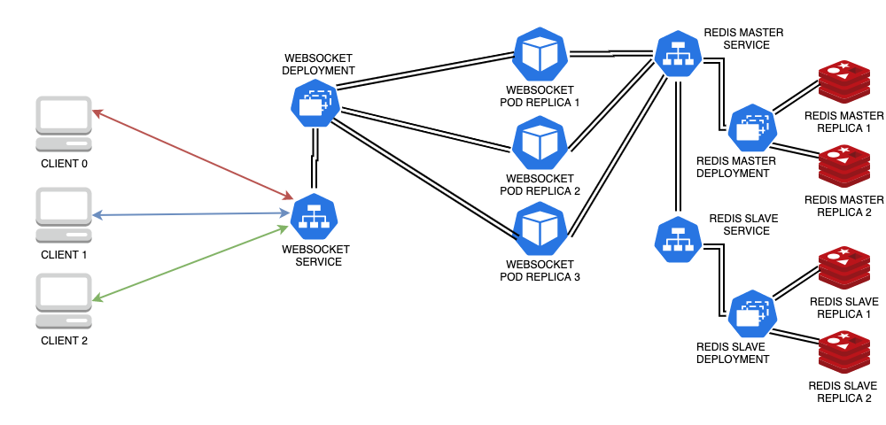

# Scaling Websockets in the Cloud. Creating a robust solution leveraging Socket.io and Redis in a cluster configuration with Docker and Kubernetes. Adding a single point of access via Traefik

In this post we will go through several configuration of Websockets. Let's say from zero infrastructure to quite complex cluster configurations.

## Intro

Websocket is a wide spread protocol allowing full-duplex communication over TCP. There are several libraries implementing that protocol, one of the most robust and well-known is `Socket.io` on the Javascript side, which allows to quickly create real-time communication patterns.

## Simple End-to-End Communication

Creating a single server in `NodeJS` where multiple clients can connect is fairly simple and straightforward using any example of the `Socket.io` library itself.

|  |
| :--: |

One of the main feature of the library is that it can wrap the websocket within an http server.
For example, a first approach can be thta as soon as a client connects to the websocket, the server application logs the message and may wait for a specific `topic` on it:

```Javascript
// Server
const socketServer = require('http').createServer();
const io = require('socket.io')(socketServer, {});
const socketPort = 5000;

io.on('connection', client => {
  console.log('New incoming Connection from', client.id);
  client.on('testMsg', function(message) {
    console.log('Message from the client:',client.id,'->',message);
  })
});
socketServer.listen(socketPort);

// Client
const io = require('socket.io-client');
const client = io('http://localhost:5000', {
  transports: ['websocket']
});

client.on('connect', function(){
  console.log("Connected!");
  client.emit('testMsg', 'a message');
});
```

The server after client connection will wait for messages of type `testMsg`.

The client is configured to employ native websockets, without attempting naïves solutions as http polling.

```Javascript
{ transports: ['websocket'] }
```

The server is also able to broadcast messages to all the clients connected to the websocket.

```Javascript
io.emit("brdcst", 'A broadcast message');
```

`Tip`: that messages will be received by ALL the clients connected.

## Multi-Server to Multi-Client communication

The previous example was simple and fun. We can play with it effectively. But creating a scalable multiserver architecture is another story and is not as immediate as the previous case.

There are 2 main issues to take into account:

1. multiple websocket servers involved should coordinate among themselves. Once a server receives a message from a client, it should ensure that all clients connected to all server receive this message.
2. when a client handshakes and establishes a connection with a server, all its future messages should pass through the same server, otherwise another server will refuse further messages upon receiving them.

Luckily the two problems are not so difficult as they appear.

The first problem can be natively addressed by employing an `Adapter`. This `Socket.io` mechanism, which natively is *in-memory*, allows to pass messages between processes (servers) and to broadcast events to all clients.
The most suitable adapter for a multi-server scenario is [socket.io-redis](https://github.com/socketio/socket.io-redis), leveraging the pub/sub paradigm of `Redis`.
As anticipated the configuration is simple and smooth, just a small piece of code is needed.

```Javascript
const redisAdapter = require('socket.io-redis');
const redisHost = process.env.REDIS_HOST || 'localhost';
io.adapter(redisAdapter({ host: redisHost, port: 6379 }));
```

The second problem of keeping a session initialized by one client with the same origin server can be addressed without particular pain. The trick resides in creating `sticky` connections so that when a client connects to a specific server, it begins a session that is effectively bound to the same server.

This cannot be achieved directly but we should place *something* in front of the NodeJS server application.
This may typically be a `Reverse Proxy`, like NGINX, HAProxy, Apache Httpd. In case of HAProxy, imagining two replicas of the websocket server application, the configuration of the *backend* part would be:

```Bash
  cookie io prefix indirect nocache
  server ws0 socket-server:5000 check cookie ws0
  server ws1 socket-server2:5000 check cookie ws1
```

which sets the *io* session cookie upon handshake.

### Multi-Server recap

To summarize what you should expect with this configuration:

1. Each client will establish a connection with a specific websocket application server instance.
2. Any message sent from the client is always passing through the same server with whom the session was initialized.
3. Upon receiving a message, the server may broadcast it. The adapter is in charge of advertising all the other servers that will in turn forward the message to all the clients which have established a connection with them.

## Containerizing everything: a Docker Stack of Microservices

What we seen so far can be summarized in the following diagram:

|  |
| :--: |

The natural evolution is a bunch of microservices containerized as Docker images. Our previous scenario holds 3 building blocks that can be containerized:

* Websocket server application (1+ replicas)
* Redis (pub/sub adapter)
* HAProxy (as Reverse Proxy handling Sticky Connections)

For the first service I created a predefined multi-staged [Docker image](https://hub.docker.com/r/sw360cab/wsk-base) starting from the `NodeJS` native image in its `alpine` variant. The other two microservices will work with native images.
The 3 services can leverage `docker-compose` to be deployed. Their configuration can be the following:

```yaml
version: '3.2'
services:
  socket-server:
    image: sw360cab/wsk-base:0.1.1
    container_name: socket-server
    restart: always
    deploy:
      replicas: 2
    environment:
      - "REDIS_HOST=redis"

  proxy:
    image: haproxy:1
    container_name: proxy
    ports:
      - 5000:80
    volumes:
      - ./haproxy.cfg:/usr/local/etc/haproxy/haproxy.cfg
    depends_on:
      - socket-server

  redis:
    image: redis:5.0
    container_name: redis
```

The `deploy` part will only work in a `Swarm` stack deployment. Assuming that you have a `Swarm` up and ready, the deploy can be started with:

```bash
docker stack deploy --compose-file stack/docker-compose.yml wsk
```

However the previous option (*deploy*) is not valid outside a `Swarm`, for example within a local development environment.

In this case you may use the `docker-compose` basic command. An extra replica of the websocket server application may be manually added.

```yaml
socket-server2:
  image: sw360cab/wsk-base:0.1.0
  container_name: socket-server2
  restart: always
  environment:
    - "REDIS_HOST=redis"
```

`Tip`: another elegant way to achieve that is by using `docker-compose up -d --scale socket-server=2`

Now to bring everything up is sufficient to execute:

```bash
docker-compose up -d
```

`Tip`: when using `HAProxy` remember to define the correct hostnames of the endpoint involved in the configuration file.

```bash
backend bk_socket
  http-check expect status 200
  cookie io prefix indirect nocache
  # Using the `io` cookie set upon handshake
  server ws0 socket-server:5000 check cookie ws0
  # Uncomment following line for non-Swarm usage
  #server ws1 socket-server2:5000 check cookie ws1
```

`Tip`: After introducing a *Reverse Proxy* remember to tune the endpoint hostname and port which the client will attempt to connect to.

## Orchestrating more and more: a Kubernetes cluster in action

So far, we have already addressed our problems for a multi-server case. We also achieved a containerized stack of microservices in Docker.
Now we are able to add a further step, we can orchestrate all the microservices transforming them in `Kubernetes` (*K8s*) resources and running in a cluster.

The shift from Docker is really easy. First of all we can drop the Reverse Proxy service, we will see later why. Then we will transform each service into a pair of service and deployment. The service will be the interface for receiving requests, whereas the deployment will maintain a replica set of pods (if you don't know K8s terminology, imagine each pod as a container) running the application: in this case either the Websocket application or Redis.
Each request received by the service will be forwarded to the replica set defined by the deployment.

Supposing that you have a K8s cluster setup (I suggest [K3s](https://k3s.io/ "K3s: Lightweight Kubernetes") or [Kind](https://kind.sigs.k8s.io/docs/user/quick-start/ "kind") for development purpose), we will have:

* Redis service and deployment (to add more sugar in the [repo]((https://github.com/sw360cab/websockets-scaling)) I employed a Master-Slave Redis solution )
* Websocket Application service and deployment (the latter is composed of 3 replicas of the custom image of the NodeJS application)

The new architecture we will achieve can be summarized as follow:

|  |
| :--: |

## Websocket Kubernetes Service

As we seen before in this shift towards Kubernetes we skipped the Reverse Proxy part (*HAProxy*).
This is completely on purpose, because creating a Kubernetes Service enables directly such a form of proxing.

Although a Kubernetes Service can be exposed outside the cluster in many ways (NodePort, LoadBalancer, Ingress, check [here](https://kubernetes.io/docs/concepts/services-networking/service/#publishing-services-service-types)), in this case I decided for a simple way. Indeed using `NodePort` allows to expose a specific port, where the clients will connect to.

```yaml
apiVersion: v1
kind: Service
metadata:
  name: wsk-svc
spec:
  selector:
    app: wsk-base
  sessionAffinity: ClientIP
  sessionAffinityConfig:
    clientIP:
      timeoutSeconds: 10
  ports:
    - protocol: TCP
      port: 3000
      targetPort: 5000
      nodePort: 30000
  type: NodePort
```

The key point of the service is `sessionAffinity: ClientIP` which will mimic Sticky connection for the service.

* `Tip`: In general `Round Robin` among Pods is not guaranteed using a simple solution like *NodePort*. In order to mimic Round Robin policy, this part of the previous configuration was employed:

```yaml
sessionAffinityConfig:
  clientIP:
    timeoutSeconds: 10
```

The cluster can established with simple `kubectl` commands:

```bash
# Launch Redis Master/Slave Deployment and Service
kubectl create -f k8s/redis
# Launch Websocket Deployment and Service
kubectl create -f k8s/wsk
```

### Client Gotchas

Dealing with this new architecture will lead to slight changes to client:

* the endpoint should be tuned according to cluster configuration. In the case above with local cluster having a NodePort service, the endpoint will be `http://localhost:30000`

* relying on the K8s orchestration means that pods can be transparently rescheduled. So a pod can be suddenly terminated and this can give a hard time to the client.
However if we add `reconnection` policies to the client, as soon as the connection is lost, it will reconnect to the first available pod in the replica set maintained by the deployment.

Here is the new client configuration:

```Javascript
const io = require('socket.io-client')
const client = io('http://localhost:30000', {
  reconnection: true,
  reconnectionDelay: 500,
  reconnectionAttempts: 10,
  transports: ['websocket']
});
```

## Conclusions

In this part we started from scratch and we land to a fully clustered architecture.
In a following chapter we will see of we can achieve an even more sophisticated solution.

## References

* [sw360cab/websockets-scaling: A tutorial to scale Websockets both via Docker Swarm and Kubernetes](https://github.com/sw360cab/websockets-scaling)
* [Scaling Websockets Tutorial](https://hackernoon.com/scaling-websockets-9a31497af051)
* [Socket.io - Using Multiple Nodes](https://socket.io/docs/using-multiple-nodes/)
* [Scaling Node.js Socket Server with Nginx and Redis](https://blog.jscrambler.com/scaling-node-js-socket-server-with-nginx-and-redis/)
* [Deploying a real time notification system on Kubernetes](https://medium.com/@faiyaz26/deploying-a-real-time-notification-system-on-kubernetes-part-2-1a28b4321dfc)

---
## Trefik: the all-in-one solution

`Traefik` is
It has a multipurpose structure so that it can be employed as a standalone service but, thanks to the concepts of `Providers`, it works smoothly in a fully `Docker` environment or as a `Kubernetes` resource, likely in many others.


It can have a static and a Dynamcic Configuration


Dashboard

Going back to what explained before


The above image explain tha basic blocks of `Traefik`:

* entrypoints
* routers
* middlewares
* services

`Tip`: take a moment to understand basic concepts and different kind and blocks of configuration in `Traefik`, you will become immediately friends. Otherwise it may happen that it gives you hard time. Deal with it at the end you will cope and win together.

### Traefik in Docker

Traefik can be defined as a single service in your compose file.


Interested services will be dynamically reachable using the concept of [Docker Labels](https://docs.docker.com/compose/compose-file/#labels). This list will contain all the definitions allowing Traefik to discover the interested service

`Tip`: If any sort of troubleshooting is needed add options to enbale access logging and debug level detail

```yaml
  - "--accesslog"
  - "--log.level=DEBUG"
```

### Traefik in Kubernetes

Traefik in Kubernetes may act as an `Ingress` resource, the entrypoint to a specific service, that can be bound to a domain name and port. In version 2.2 Traefik improved is terminology, so that the state of the art way is defining an `Ingress Route` through a Kubernetes `CRD` (Custom Resource Definition).
In this environment Traefik require the definition of the followings:

- CRD
- RBAC (Role-Based Access Control) defining the items:
  - ServiceAccount
  - ClusterRole (with access to specific api groups in K8S)
  - ClusterRoleBinding (binding the previous two items)
- a Deployment (of the Traefik Pods)

```Yaml
serviceAccountName: traefik-ingress-controller
containers:
  - name: traefik
    image: traefik:v2.2
    args:
      - --api.insecure
      - --accesslog
      - --entrypoints.web.address=:80
      - --entrypoints.websecure.address=:443
      - --providers.kubernetescr
```

- a Service (exposing the entrypoint to the external world)
- an IngressRoute. Which is the core of our configuration specifing the router rules, the service to be bound, the entrypoint of reference and eventually extra-rules of middlewares

```yaml
kind: IngressRoute
apiVersion: traefik.containo.us/v1alpha1
metadata:
  name: simpleingressroute
  namespace: default
spec:
  entryPoints:
    - web
  routes:
  # - match: Host(`your.example.com`) && PathPrefix(`/notls`)
  - match: PathPrefix(`/`)
    kind: Rule
    services:
    - name: wsk-svc
      port: 3000
```

`Tip`: whether your service will have access from a predifined domain the router match ruls will be something like:

```yaml
- match: Host(`your.example.com`) && PathPrefix(`/`)
```

### Going beyond

`Socket.io` by default will expose the default websocket endpoint adding a `/socket.io` suffix at the end. This is quite strange when you start reaching your websocket in a complex environment.

The solution is fixing the path of the websocket in the application.

```Javascript
const socketServer = require('http').createServer();
const io = require('socket.io')(socketServer, {
  path: '/'
})
```

`Tip` You may not be able to expose your service on a root endpoint ('/'). Defining an endpoint different from root is not so easy, especially when clients connect. Some extra work is needed also in Traefik. On the repository code this scenario is covered.

## References

* [Scaling Websockets Tutorial](https://hackernoon.com/scaling-websockets-9a31497af051)
* [Socket.io - Using Multiple Nodes](https://socket.io/docs/using-multiple-nodes/)
* [Scaling Node.js Socket Server with Nginx and Redis](https://blog.jscrambler.com/scaling-node-js-socket-server-with-nginx-and-redis/)
* [Deploying a real time notification system on Kubernetes](https://medium.com/@faiyaz26/deploying-a-real-time-notification-system-on-kubernetes-part-2-1a28b4321dfc)

---
* [Concepts - Traefik](https://docs.traefik.io/getting-started/concepts/ "Concepts - Traefik")
* [Docker - Traefik](https://docs.traefik.io/providers/docker/ "Docker - Traefik")
* [Docker - Traefik](https://docs.traefik.io/routing/providers/docker/ "Docker - Traefik")
* [Docker - Traefik](https://docs.traefik.io/reference/dynamic-configuration/docker/ "Docker - Traefik")
* [Kubernetes IngressRoute - Traefik](https://docs.traefik.io/routing/providers/kubernetes-crd/ "Kubernetes IngressRoute - Traefik")
